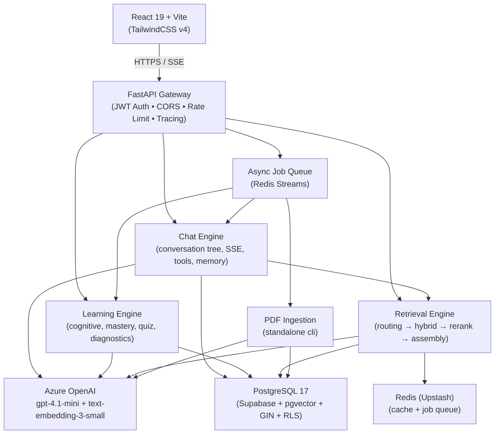

# VishwAlpha 2.0 — Master Implementation Plan

## PHASE 0: Discovery Report ✅

### Detected Stack

| Layer | Current | Verdict |
|---|---|---|
| **Backend** | FastAPI + SQLAlchemy + uvicorn | ✅ Keep — already production-quality |
| **DB** | PostgreSQL 17.6 (Supabase) + pgvector | ✅ Keep — DB is empty & ready for new schema |
| **LLM (chat)** | GPT-4.1-mini via Azure Foundry (`viswalpha-gpt-4.1-mini`) | ✅ Keep |
| **LLM (embed)** | text-embedding-3-small 1536-dim (`viswalpha-text-embedding-3-small`) | ✅ Keep |
| **LLM (vision/cheap)** | None currently | ⚠️ Proposal: reuse GPT-4.1-mini with vision content blocks; add a cheap routing model if/when TPM quotas increase |
| **Cache** | Redis (Upstash) | ✅ Keep — upgrade to sorted sets for job queues |
| **Frontend** | React 19 + Vite + TailwindCSS v4 | ✅ Keep — reuse/extend |
| **Package manager (Python)** | `uv` | ✅ Keep |
| **Auth** | Custom JWT (HS256) via `python-jose` | ⚠️ Extend to refresh tokens, email-verification, roles |
| **PDF tools** | pdfminer-six, pymupdf, paddleocr, unstructured | ✅ Keep for ingestion pipeline |
| **Rate limiting** | slowapi | ✅ Keep |
| **Streaming** | sse-starlette (SSE) | ✅ Keep |
| **Deployment** | Local dev; Supabase (cloud PG) | As-is for now |

### What Currently Exists (Keep / Rework / Drop)

| Area | Status | Action |
|---|---|---|
| `app/api/auth.py` | Login/register with JWT access token | 🔄 Extend: refresh token, email verify, roles |
| `app/api/chat.py` | Single-turn chat + SSE stream | 🔄 Rework: conversation tree, branching, tools |
| `app/api/quiz.py` | Mid-concept & yesterday quiz generation | 🔄 Extend into full adaptive quiz engine |
| `app/api/sessions.py` | Session CRUD | 🔄 Rework: Study Spaces, pinning, search, archive |
| `app/api/student.py` | Cognitive profile + memory | 🔄 Extend: preferences, goals, recommendations |
| `app/api/curriculum.py` | Chapter/topic lookup | 🔄 Extend: block-level hierarchy |
| `app/api/admin.py` | Admin key-gated operations | 🔄 Extend: ingestion dashboard, reports |
| `app/api/deps.py` | JWT dependency injection | 🔄 Extend: role guard, refresh, parent roles |
| `app/services/chat_orchestrator.py` | 8-step pipeline | 🔄 Rework: tree messages, tools, memory items, sources |
| `app/services/quiz_service.py` | MCQ + theory generation | 🔄 Extend: Bloom tagging, source links, AI grading |
| `app/services/retrieval_service.py` | Hybrid retrieval | 🔄 Rework: hierarchical routing + hybrid + rerank |
| `app/services/tutor_llm.py` | LLM call wrappers | 🔄 Extend: model registry, prompt templates, A/B |
| `app/services/ingestion_pipeline.py` | Basic PDF ingestion | 🔄 Rework into `pdf_ingestion/` standalone module |
| `app/data/models.py` | SQLAlchemy ORM | 🔄 Replace: fresh models from new migrations |
| **Frontend auth page** | Login/register | ✅ Keep UI shell |
| **Frontend chat page** | Chat + sidebar + quiz | 🔄 Extend: branching, artifacts, memory view, study spaces |
| **Old DB schema** | DROPPED by user | ✅ Start fresh |

### Reference Schema — Features to Preserve (Redesigned)

From `vishwalpha_supbase_sql.sql`:
- Board → class → subject → chapter → topic → content_chunk hierarchy ✅
- Two flat vector tables (`curriculum_routing`, `curriculum_content`) → **replaced** by proper block-level hierarchy with `embedding_model` column
- `student_subject_profiles` (10 cognitive metrics) → **kept**, fixed design
- `overall_cognitive_profiles` → **kept**, fixed
- `conversation_sessions` / `conversation_messages` → **reworked** into tree model
- `student_topic_mastery` + spaced rep columns → **kept**
- `topic_prerequisites` → **kept**, make cycle-safe
- `quiz_attempts` / `quiz_questions` / `subject_quiz_feedback` → **kept**, add source links
- `student_memory`, `student_tasks`, `student_goals`, `student_streaks`, `student_learning_preferences`, `diagnostic_states`, `session_insights` → **kept**, normalised
- `pending_metric_signals` → **kept**
- `prompt_logs` → **reworked** into `llm_call_logs` (partitioned, with cost)

### Key Rate-Limit Note (from `viswalpha-api.md`)
- GPT-4.1-mini: **10,000 TPM / 10 req/min** — hard limit; streaming and caching are essential
- text-embedding-3-small: **10,000 TPM / 10 req/10 sec** — batch embeds + Redis cache mandatory

---

## GATE 0 ✅ — Stack confirmed; discovery complete.

---

## PHASE 1: Architecture & API Spec

> **STATUS: Awaiting GATE 0 approval before writing this section.**

### Proposed Module Boundaries

```
app/
  api/           # FastAPI routers (thin: validate → service → response)
  services/      # Business logic (orchestrators, engines, generators)
    chat/        # conversation tree, streaming, tools, memory, artifacts
    learning/    # cognitive metrics, mastery, spaced-rep, quiz, diagnostics
    retrieval/   # routing, hybrid search, reranking, block assembly
    content/     # ingestion coordinator (delegates to pdf_ingestion/)
    platform/    # auth, quotas, moderation, jobs, observability
  data/
    models/      # SQLAlchemy ORM (one file per domain)
    repos/       # Data access layer (no SQL in services)
    migrations/  # Alembic versioned migrations (up + down)
  infra/
    llm/         # Model registry, prompt templates, A/B routing
    cache/       # Redis wrapper (embedding, retrieval, prereq caches)
    jobs/        # Async job queue (Redis Streams or pg-based)
    observability/ # Tracing, metrics, audit log
  config.py      # Pydantic-Settings (all env vars)
  main.py        # App factory

pdf_ingestion/   # Standalone ingestion package
  __main__.py    # CLI entrypoint
  pipeline/      # 9 stages (hash→structure→extract→enrich→upsert→report)
  tests/

frontend/
  src/
    api/         # Typed API client (auth, chat, quiz, learning)
    components/  # Design system components
      chat/      # MessageTree, ConversationList, BranchPicker, Artifacts
      quiz/      # QuizModal, QuestionCard, ResultsPanel
      learning/  # CognitiveCard, MasteryTimeline, StreakBadge
      platform/  # AuthModal, SettingsPanel, SubjectSelector
    pages/       # AuthPage, ChatPage, StudySpacePage, ProfilePage
    store/       # Zustand state (auth, conversations, ui)
    hooks/       # useSSE, useConversation, useQuiz
```

### Architecture Diagram (Mermaid)



---

## PHASE 2: Schema (Full Migration Set)

> **STATUS: Awaiting GATE 1 approval.**

### Domain Groups (one migration file each)

| Migration | Domain | Tables |
|---|---|---|
| `001_platform` | Auth & platform | `languages`, `roles`, `users`, `user_sessions`, `guardian_consents`, `audit_log`, `abuse_reports` |
| `002_content` | Curriculum content | `boards`, `classes`, `subjects`, `books`, `chapters`, `topics`, `subtopics`, `content_blocks`, `block_embeddings`, `book_ingestion_log`, `curriculum_coverage` |
| `003_chat` | Chat engine | `study_spaces`, `conversations`, `messages`, `message_content_blocks`, `message_sources`, `conversation_summaries`, `attachments`, `artifacts`, `artifact_versions`, `share_links`, `message_feedback`, `tool_call_log` |
| `004_learning` | Adaptive learning | `student_profiles`, `student_subject_profiles`, `cognitive_metric_history`, `learning_preferences`, `student_memory_items`, `topic_mastery`, `mastery_events`, `topic_prerequisites`, `quiz_attempts`, `quiz_questions`, `quiz_question_sources`, `session_insights`, `diagnostic_states`, `student_goals`, `student_streaks`, `student_tasks`, `pending_metric_signals`, `subject_quiz_feedback` |
| `005_platform_ops` | Ops & observability | `llm_call_logs`, `usage_ledger`, `rate_limit_configs`, `job_queue`, `prompt_templates`, `model_registry`, `ab_experiments` |
| `006_rls` | Row-Level Security | RLS policies on all student-data tables |
| `007_indexes` | Performance | HNSW, GIN full-text, trigram, composite FK indexes |

### Key Design Decisions (vs Old Schema)

| Old Flaw | New Design |
|---|---|
| Free-text `subject` column everywhere | `subject_id FK → subjects.id`; subjects are IDs, never text |
| Two flat vector tables (`curriculum_routing`, `curriculum_content`) | `content_blocks` + `block_embeddings` (separate table, records `embedding_model`) |
| `content` column = raw + LLM output mixed | `content_blocks.raw_text` (verbatim), `content_blocks.enriched_*` (LLM-generated, labelled with `prompt_version`) |
| Single `content` column in messages | `message_content_blocks` table (type: text/code/image/citation/artifact) |
| `pending_signals TEXT` (JSON in text) | `pending_metric_signals.signals JSONB` |
| No language support | `languages` table + `lang_code` column on every content table + cross-language links |
| `conversation_messages` flat list | `messages` with `parent_message_id` tree + `active_message_id` per conversation |
| `prompt_logs TEXT` | `llm_call_logs` partitioned by month, with model, tokens, cost_usd |
| No cost tracking | `usage_ledger` per student per day |
| No async jobs | `job_queue` table (or Redis Streams) |
| No RLS | RLS policies on all `student_*` and `conversation_*` tables |
| `student_memory TEXT` JSON array | `student_memory_items` table (one row = one fact, with source `message_id`, `is_active`) |
| String-based topic matching for mastery | `topic_mastery.topic_id FK → topics.id` |
| No CHECK constraints on ranges | `CHECK` constraints on every 0-100 float metric |
| No UNIQUE on (student, topic) | `UNIQUE (student_id, topic_id)` on `topic_mastery` |
| No book or block-level citations | `message_sources (message_id, block_id, rank, score, used_in_answer)` |

---

## PHASE 3–9 (Planned)

> Each phase detailed after approval of previous GATE.

| Phase | Description | Gate Criteria |
|---|---|---|
| 3 | PDF ingestion pipeline standalone module | Ingest one chapter; coverage report; sample rows |
| 4 | Retrieval & context engine | 10 sample questions in 2 languages with retrieved blocks |
| 5 | Chat engine (tree, streaming, tools, memory, artifacts) | Edit-branch, regenerate, stop, resume, image, incognito demo |
| 6 | Adaptive learning engine | Cognitive formulas documented; quiz flow; mastery update |
| 7 | Platform (auth, quotas, moderation, jobs, observability, RLS) | All student tables RLS-protected; job queue running |
| 8 | API + frontend integration + tests | Auth, chat, quiz, mastery tests pass |
| 9 | Evaluation + handover | 30-question golden set; load test; final README |

---

## Open Questions for GATE 0 → 1

1. **New Supabase account:** You mentioned using a different Supabase account for testing. Should I write the new `.env.example` with a `DATABASE_URL_TEST` placeholder, or will you provide the new connection string before Phase 2 starts?
2. **Deployment scale:** The prompt asks for expected scale (students / concurrent chats). Current quota is 10 req/min for LLM — this caps at ~10 concurrent streaming chats. Is this acceptable for the test phase, or do we need to plan quota increases?
3. **Language support for Phase 1:** Should Hindi be fully supported in the schema from day one (separate translated content rows), or is it a Phase 2 addition? I recommend day-one to avoid schema migrations later.
4. **Guardian/parent consent:** For the auth roles (student, parent, teacher, admin) — is there a specific age cutoff (e.g., <13 requires guardian email), or should I use 18 as the threshold?
5. **Frontend rebuild vs extend:** The existing React frontend has auth + chat + sidebar + quiz shell. Do you want me to rebuild it entirely (cleaner code) or extend it incrementally? Recommendation: rebuild page-by-page, keeping the design token system.
6. **Artifact storage:** Generated notes/flashcards/mind maps — store as text/JSON in PG only, or also export to a file bucket (Supabase Storage / S3)?

---

## Verification Plan (Phase 0 Gate)

- [x] Reference SQL read in full
- [x] API credentials and rate limits documented
- [x] Existing backend modules inventoried
- [x] Existing frontend structure inventoried
- [x] Stack confirmed (FastAPI + React + Azure OpenAI + Supabase PG + Redis)
- [x] All design flaws in old schema identified and mapped to new design
- [ ] User approves this plan → proceed to Phase 1
