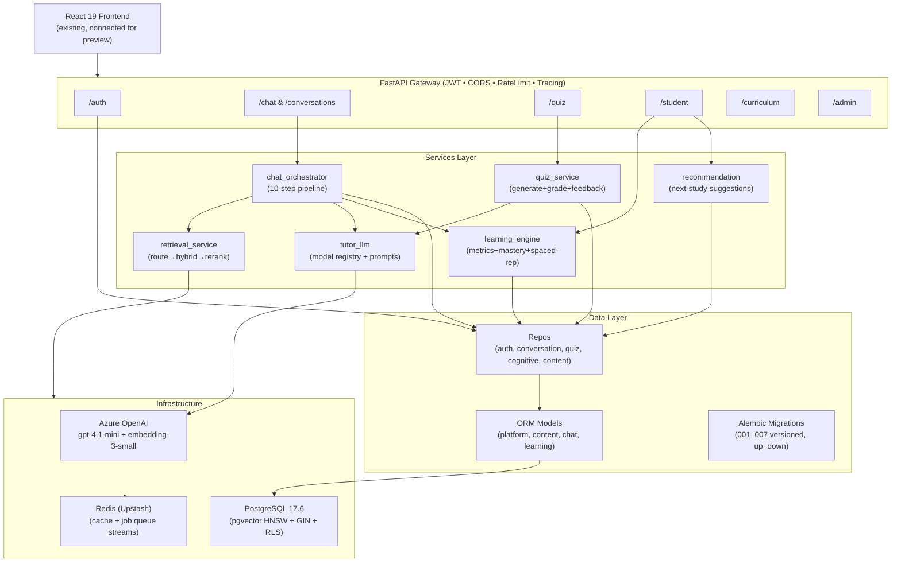

# VishwAlpha 2.0 — Phase 1: Architecture & API Specification

## Confirmed Scope (from GATE 0)

| Decision | Value |
|---|---|
| Focus | **Backend only** (frontend wired to existing UI for preview) |
| Language | English only for now (schema has `lang_code` stub column, unused) |
| Auth | JWT (access + refresh); roles: `student`, `admin` (no guardian/parent for now) |
| Artifacts | Stored as JSONB in PostgreSQL |
| Async jobs | Redis Streams (reuse existing Upstash Redis) |
| DB | Fresh Supabase account (PostgreSQL 17 + pgvector) |
| Test URL | `DATABASE_URL_TEST` placeholder in `.env.example` |
| LLM | Azure OpenAI: `viswalpha-gpt-4.1-mini` (chat + quiz + grading + feedback + routing) |
| Embeddings | `viswalpha-text-embedding-3-small` 1536d (blocks + routing) |
| Rate limits | 10 req/min LLM; 10 concurrent chats acceptable |

---

## 1. Module Boundaries

```
app/
├── main.py                    # App factory, lifespan, middleware, router registration
├── config.py                  # Pydantic-Settings (ALL env vars; single import)
├── middleware.py              # CORS, SecurityHeaders, RequestTracing, RateLimiting
│
├── api/                       # FastAPI routers — thin (validate → service → response)
│   ├── deps.py                # Reusable FastAPI Depends: get_current_student, get_db, roles
│   ├── auth.py                # /auth — register, login, refresh, logout
│   ├── chat.py                # /chat — send, stream, stop; /conversations — CRUD
│   ├── sessions.py            # /conversations — list, rename, pin, archive, delete, search
│   ├── quiz.py                # /quiz — generate, answer, finish, history, feedback, yesterday
│   ├── student.py             # /student — profile, memory, preferences, goals, streaks
│   ├── curriculum.py          # /curriculum — hierarchy lookup (read-only)
│   └── admin.py               # /admin — ingest trigger, coverage reports, user management
│
├── services/                  # Business logic — no HTTP knowledge, no ORM queries
│   ├── chat_orchestrator.py   # 10-step pipeline (see §3)
│   ├── retrieval_service.py   # Hierarchical routing → hybrid search → rerank → assembly
│   ├── quiz_service.py        # Generation, AI grading, feedback, concept-completion detector
│   ├── learning_engine.py     # Cognitive metric computation, mastery updates, spaced rep
│   ├── recommendation.py      # "What to study next" from mastery + goals + review dates
│   └── tutor_llm.py           # LLM client: model registry, prompt templates, streaming
│
├── data/                      # Data access — all DB queries live here, nowhere else
│   ├── database.py            # Engine, SessionLocal, managed_session, get_db, init_db
│   ├── models/                # SQLAlchemy ORM models, one file per domain
│   │   ├── __init__.py        # Re-exports all models + Base
│   │   ├── platform.py        # users, user_sessions, roles, audit_log
│   │   ├── content.py         # boards, classes, subjects, books, chapters, topics,
│   │   │                      # subtopics, content_blocks, block_embeddings, ingestion_log
│   │   ├── chat.py            # conversations, messages, message_content_blocks,
│   │   │                      # message_sources, attachments, artifacts, artifact_versions,
│   │   │                      # share_links, message_feedback, tool_call_log
│   │   └── learning.py        # student_profiles, student_subject_profiles,
│   │                          # cognitive_metric_history, learning_preferences,
│   │                          # student_memory_items, topic_mastery, mastery_events,
│   │                          # topic_prerequisites, quiz_attempts, quiz_questions,
│   │                          # quiz_question_sources, session_insights, diagnostic_states,
│   │                          # student_goals, student_streaks, student_tasks,
│   │                          # pending_metric_signals, subject_quiz_feedback
│   │
│   ├── repos/                 # One repo per domain — thin query functions
│   │   ├── auth_repo.py       # user CRUD, session tokens, password ops
│   │   ├── conversation_repo.py  # conversation + message tree ops
│   │   ├── quiz_repo.py       # quiz attempt + question ops
│   │   ├── cognitive_repo.py  # metric reads/writes, mastery, spaced-rep, signals
│   │   └── content_repo.py    # curriculum hierarchy reads (read-only)
│   │
│   └── migrations/            # Alembic versioned migrations (up + down)
│       ├── env.py
│       ├── script.py.mako
│       └── versions/
│           ├── 001_platform.py
│           ├── 002_content.py
│           ├── 003_chat.py
│           ├── 004_learning.py
│           ├── 005_platform_ops.py
│           ├── 006_rls.py
│           └── 007_indexes.py
│
├── infra/                     # Infrastructure adapters
│   ├── azure_openai_client.py # OpenAI client factory (cached singleton)
│   ├── cache.py               # Redis wrapper: embedding, retrieval, prereq caches
│   ├── jobs.py                # Redis Streams job enqueue/consume
│   ├── vector_router.py       # pgvector cosine routing (chapter → topic)
│   └── embeddings.py          # Embed text, batch, cache-first
│
└── schemas/                   # Pydantic request/response models, one file per domain
    ├── __init__.py
    ├── auth.py
    ├── chat.py
    ├── quiz.py
    ├── student.py
    └── content.py

pdf_ingestion/                 # Standalone ingestion package (Phase 3)
```

---

## 2. Architecture Diagram



---

## 3. Chat Pipeline (10 Steps)

Every `POST /chat` or `POST /chat/stream` executes:

| Step | Action | Key Module |
|---|---|---|
| 1 | Load/create conversation from `conversation_id`; resolve `student_id` from JWT | `conversation_repo`, `auth_repo` |
| 1b | New conversation: fetch yesterday's context, spaced-review topics, update streak | `cognitive_repo`, `quiz_repo` |
| 2 | Load recent message history (last N tokens) + student memory items | `conversation_repo`, `cognitive_repo` |
| 2b | Load learning preferences + weak topics (mastery < threshold) | `cognitive_repo` |
| 3 | Classify question: regex heuristic → LLM fallback (curriculum / conversational) | `question_classifier` in `retrieval_service` |
| 3b | Detect Bloom's level + sentiment from the student message | `learning_engine` |
| 4 | If curriculum: hierarchical route (embed → cosine to `block_embeddings`) → hybrid full-text+vector search in subtree → rerank → token-budget assembly | `retrieval_service` |
| 5 | Build prompt (system prompt + preferences + memory + context + history); generate SSE stream | `tutor_llm` |
| 5b | Background: generate/update conversation title for new conversations | `tutor_llm` (async thread) |
| 5c | Detect concept completion → set `quiz_suggestion` in response | `quiz_service` |
| 6 | Persist student `message` + tutor `message` (both as `message_content_blocks` rows); write `message_sources` | `conversation_repo` |
| 6b | Update conversation analytics (`total_msgs`, `session_mood`, `bloom_levels_hit`) | `conversation_repo` |
| 7 | Collect cognitive signals → append to `pending_metric_signals` | `cognitive_repo` |
| 7b | Update `topic_mastery` for the routed topic | `cognitive_repo` |
| 7c | Every 4 turns: batch-update cognitive profile + generate remark + update memory items | `cognitive_repo`, `tutor_llm` |
| 8 | Log LLM call (model, tokens, cost) to `llm_call_logs`; log to `usage_ledger` | `infra/jobs` (async) |
| 9 | Return `ChatResponse` or stream SSE tokens | `api/chat` |

---

## 4. Full API Contract

### Auth — `/auth`

| Method | Path | Auth | Request Body | Response |
|---|---|---|---|---|
| POST | `/auth/register` | None | `{username, email, password, class_num}` | `{user_id, access_token, refresh_token}` |
| POST | `/auth/login` | None | `{email_or_username, password}` | `{user_id, access_token, refresh_token}` |
| POST | `/auth/refresh` | Refresh token (header) | — | `{access_token}` |
| POST | `/auth/logout` | Bearer JWT | — | `{ok: true}` |
| GET | `/auth/me` | Bearer JWT | — | `{user_id, username, email, class_num, role}` |

### Conversations — `/conversations`

| Method | Path | Auth | Request / Params | Response |
|---|---|---|---|---|
| GET | `/conversations` | JWT | `?page&limit&subject&archived` | `[ConversationSummary]` |
| POST | `/conversations` | JWT | `{subject_id?, title?, study_space_id?}` | `ConversationDetail` |
| GET | `/conversations/{id}` | JWT | — | `ConversationDetail + messages tree` |
| PATCH | `/conversations/{id}` | JWT | `{title?, is_pinned?, is_archived?}` | `ConversationDetail` |
| DELETE | `/conversations/{id}` | JWT | — | `{ok: true}` (soft delete) |
| GET | `/conversations/search` | JWT | `?q&subject&limit` | `[ConversationSearchResult]` |

### Chat — `/chat`

| Method | Path | Auth | Request Body | Response |
|---|---|---|---|---|
| POST | `/chat` | JWT | `ChatRequest` | `ChatResponse` |
| POST | `/chat/stream` | JWT | `ChatRequest` | SSE stream of `ChatStreamEvent` |
| POST | `/chat/stop` | JWT | `{stream_id}` | `{ok: true}` |

**`ChatRequest`:**
```json
{
  "conversation_id": "uuid-or-empty",
  "parent_message_id": "uuid-or-null",
  "question": "string (1-4000 chars)",
  "subject_id": 42,
  "tutor_mode": "standard|deep",
  "idempotency_key": "client-uuid"
}
```

**`ChatResponse`:**
```json
{
  "conversation_id": "uuid",
  "message_id": "uuid",
  "answer": "markdown string",
  "sources": [{"block_id": int, "chapter": str, "topic": str, "score": float}],
  "routed_chapter": "str",
  "routed_topic": "str",
  "question_type": "curriculum|conversational",
  "cognitive_skills": {},
  "quiz_suggestion": {"topic": str, "subject_id": int, "num_questions": 7} | null,
  "yesterday_context": {"subject": str, "topic": str, "date": str} | null,
  "is_new_conversation": bool
}
```

### Quiz — `/quiz`

| Method | Path | Auth | Request / Params | Response |
|---|---|---|---|---|
| GET | `/quiz/yesterday` | JWT | — | `YesterdayContext` or `null` |
| POST | `/quiz/generate` | JWT | `GenerateQuizRequest` | `GenerateQuizResponse` |
| POST | `/quiz/answer` | JWT | `{attempt_id, question_id, answer, answer_index?, time_ms?}` | `AnswerResult` |
| POST | `/quiz/finish` | JWT | `{attempt_id, conversation_id?}` | `FinishQuizResponse` |
| GET | `/quiz/history` | JWT | `?subject_id&limit&page` | `[QuizHistorySummary]` |
| GET | `/quiz/feedback/{subject_id}` | JWT | — | `SubjectQuizFeedback` |
| GET | `/quiz/attempt/{attempt_id}` | JWT | — | `QuizAttemptDetail` (with answers) |

**`GenerateQuizRequest`:**
```json
{
  "subject_id": 42,
  "topic": "string",
  "source": "manual|mid_concept|yesterday|spaced_review",
  "num_questions": 7,
  "conversation_id": "optional"
}
```

**`GenerateQuizResponse`:**
```json
{
  "attempt_id": "uuid",
  "questions": [
    {
      "id": 1, "q_index": 0, "q_type": "mcq|theory",
      "question": "str", "options": ["A","B","C","D"],
      "bloom_level": "remember|understand|apply|analyze|evaluate|create",
      "difficulty": "easy|medium|hard"
    }
  ]
}
```

### Student — `/student`

| Method | Path | Auth | Request / Params | Response |
|---|---|---|---|---|
| GET | `/student/profile` | JWT | `?subject_id` | `StudentProfile` |
| GET | `/student/cognitive` | JWT | `?subject_id` | `CognitiveProfile` |
| GET | `/student/memory` | JWT | `?subject_id` | `[MemoryItem]` |
| DELETE | `/student/memory/{id}` | JWT | — | `{ok: true}` |
| PATCH | `/student/memory/{id}` | JWT | `{is_active: bool}` | `MemoryItem` |
| GET | `/student/preferences` | JWT | — | `LearningPreferences` |
| PATCH | `/student/preferences` | JWT | `{...prefs}` | `LearningPreferences` |
| GET | `/student/goals` | JWT | — | `[Goal]` |
| POST | `/student/goals` | JWT | `{goal_text, goal_type, subject_id?, target_value?, due_date?}` | `Goal` |
| PATCH | `/student/goals/{id}` | JWT | `{is_completed?, current_value?}` | `Goal` |
| DELETE | `/student/goals/{id}` | JWT | — | `{ok: true}` |
| GET | `/student/streak` | JWT | — | `Streak` |
| GET | `/student/mastery` | JWT | `?subject_id&limit` | `[TopicMastery]` |
| GET | `/student/due-for-review` | JWT | `?subject_id&limit` | `[TopicDueForReview]` |
| GET | `/student/recommendations` | JWT | `?subject_id` | `[StudyRecommendation]` |

### Curriculum — `/curriculum`

| Method | Path | Auth | Params | Response |
|---|---|---|---|---|
| GET | `/curriculum/boards` | None | — | `[Board]` |
| GET | `/curriculum/classes` | None | `?board_id` | `[ClassLevel]` |
| GET | `/curriculum/subjects` | None | `?class_id` | `[Subject]` |
| GET | `/curriculum/chapters` | None | `?subject_id` | `[Chapter]` |
| GET | `/curriculum/topics` | None | `?chapter_id` | `[Topic]` |

### Admin — `/admin`

| Method | Path | Auth | Request | Response |
|---|---|---|---|---|
| POST | `/admin/ingest` | Admin key | `IngestRequest` | `IngestJobResponse` |
| GET | `/admin/coverage` | Admin key | `?subject_id` | `CoverageReport` |
| GET | `/admin/users` | Admin key | `?page&limit` | `[UserSummary]` |
| GET | `/admin/llm-logs` | Admin key | `?date&limit` | `[LLMCallLog]` |
| GET | `/admin/usage` | Admin key | `?date_from&date_to` | `UsageSummary` |

---

## 5. Async Job Map

All background work runs via **Redis Streams** (key: `va:jobs`). Workers are co-located in the same FastAPI process as async tasks but can be extracted to separate workers later.

| Job Type | Trigger | What It Does |
|---|---|---|
| `title_generation` | New conversation, after first turn | Calls LLM to generate a short title; updates `conversations.title` |
| `memory_extraction` | Every 4 chat turns | LLM extracts new facts; upserts `student_memory_items` |
| `cognitive_batch_update` | Every 4 turns | Flushes `pending_metric_signals` → updates `student_subject_profiles` + `overall_cognitive_profiles` |
| `session_insight` | Conversation end / session close | LLM generates session insight; inserts `session_insights` |
| `mastery_decay` | Cron: nightly | Applies exponential decay to `topic_mastery.mastery_level` where `next_review_date` < today |
| `quiz_feedback_update` | After `quiz/finish` | Recomputes `subject_quiz_feedback` aggregates + LLM feedback paragraph |
| `embedding_batch` | After PDF ingest | Embeds all unembedded content blocks in batches of 50 (respects 10 TPM quota) |
| `llm_log_cleanup` | Cron: weekly | Hard-deletes `llm_call_logs` older than retention window |

---

## 6. Cognitive Metric Formulas (Documented)

All metrics are in the range **0–100** (floats). `error_repetition_rate` is **0–1**.

| Metric | Column | Update Formula |
|---|---|---|
| Concept Master Score | `concept_master_score` | `0.7 × prev + 0.3 × (quiz_accuracy × 100)` when quiz taken; `0.95 × prev + 0.05 × 60` each chat turn |
| Error Repetition Rate | `error_repetition_rate` | `0.8 × prev + 0.2 × (1 if same_mistake_seen else 0)` |
| Attempt Persistence | `attempt_persistence` | `0.85 × prev + 0.15 × (100 if followup_detected else 30)` |
| Struggle Recovery | `struggle_recovery_rate` | `0.8 × prev + 0.2 × (80 if confusion_resolved else 20)` |
| Practice Intensity | `practice_intensity` | `min(100, 0.9 × prev + 10 × questions_this_session)` |
| Learning Velocity | `learning_velocity` | `0.85 × prev + 0.15 × (100 if new_concept else 40)` |
| Knowledge Retention | `knowledge_retention` | `0.9 × prev + 0.1 × (quiz_accuracy × 100)`; decays by `decay_rate` each day without visit |
| Cognitive Thinking Level | `cognitive_thinking_level` | `0.85 × prev + 0.15 × (bloom_level_num × 100 / 6)` |
| Engagement Frequency | `engagement_frequency` | `0.9 × prev + 10` on each session, capped at 100 |
| Assessment Accuracy | `assessment_accuracy` | `running_avg(quiz_scores)` weighted 70% prev + 30% latest |
| Bloom Level Avg | `bloom_level_avg` | Running average of detected Bloom levels (1–6) |
| Frustration Index | `frustration_index` | `0.8 × prev + 0.2 × (80 if frustrated_detected else 0)` |
| Confidence Index | `confidence_index` | `0.85 × prev + 0.15 × (80 if positive_sentiment else 30)` |

**Five aggregated cognitive skills** (displayed to frontend):
- `Concept Understanding = 0.5 × concept_master_score + 0.5 × assessment_accuracy`
- `Learning Effort = 0.4 × practice_intensity + 0.3 × attempt_persistence + 0.3 × engagement_frequency`
- `Learning Adaptability = 0.6 × struggle_recovery_rate + 0.4 × (100 - error_repetition_rate × 100)`
- `Knowledge Stability = 0.5 × knowledge_retention + 0.5 × learning_velocity`
- `Cognitive Depth = cognitive_thinking_level`

---

## 7. Prompt Template System

All LLM prompts are **versioned data**, not hardcoded strings.

```python
# Stored in app/infra/prompt_registry.py as typed PromptTemplate objects
# (Future: move to DB table for hot-swapping without redeploy)

TUTOR_SYSTEM_TEMPLATE = PromptTemplate(
    name="tutor_system_v2",
    version=2,
    roles=["system"],
    slots=["class_num", "subject", "preferences", "memory_items",
           "weak_topics", "context_blocks", "conversation_summary"],
)

QUIZ_GENERATION_TEMPLATE = PromptTemplate(
    name="quiz_gen_v2",
    version=2,
    slots=["subject", "topic", "class_num", "num_questions",
           "cognitive_metrics", "student_memory"],
)

MEMORY_EXTRACTION_TEMPLATE = PromptTemplate(
    name="memory_extract_v1",
    version=1,
    slots=["conversation_excerpt", "existing_memory_items"],
)
```

Every `llm_call_logs` row records `prompt_template_name` and `prompt_version`.

---

## 8. Repository Pattern (Data Access Rules)

**Rule: No SQL or ORM queries outside `app/data/repos/`. No business logic inside repos.**

```python
# ✅ Correct: repo is a thin query function
def get_topic_mastery(db: Session, student_id: str, topic_id: int) -> TopicMastery | None:
    return db.query(TopicMastery).filter_by(student_id=student_id, topic_id=topic_id).first()

# ✅ Correct: service calls repo, applies formula
def update_mastery_from_chat(db: Session, student_id: str, topic_id: int, bloom_signal: int):
    mastery = get_topic_mastery(db, student_id, topic_id) or create_default_mastery(...)
    mastery.bloom_level_reached = max(mastery.bloom_level_reached, bloom_signal)
    mastery.mastery_level = min(100, mastery.mastery_level + 5)
    db.flush()

# ❌ Wrong: business logic in repo
# ❌ Wrong: ORM query in orchestrator
```

---

## 9. What Existing Code Is Kept / Changed

| File | Status | Change |
|---|---|---|
| `app/main.py` | 🔄 Extend | Add Alembic init check; update router registrations |
| `app/config.py` | 🔄 Extend | Add `JWT_REFRESH_SECRET`, `DATABASE_URL_TEST`, `JOB_QUEUE_KEY` |
| `app/middleware.py` | ✅ Keep | No change |
| `app/api/deps.py` | 🔄 Extend | Add refresh token dep, admin role dep |
| `app/api/auth.py` | 🔄 Extend | Add refresh + logout endpoints |
| `app/api/chat.py` | 🔄 Rework | Use `conversation_id` not `session_id`; parent_message_id; idempotency key |
| `app/api/quiz.py` | 🔄 Rework | Use `subject_id` (int); add `attempt/{id}` endpoint |
| `app/api/student.py` | 🔄 Extend | Add memory item CRUD, goals, recommendations |
| `app/api/sessions.py` | 🔄 Rename → `conversations.py` | Full conversation CRUD |
| `app/api/curriculum.py` | ✅ Keep | Minor: expose books level |
| `app/api/admin.py` | 🔄 Extend | Add coverage, llm-logs, usage endpoints |
| `app/data/models.py` | ❌ Replace | Split into `models/platform.py`, `models/content.py`, `models/chat.py`, `models/learning.py` |
| `app/data/database.py` | ✅ Keep | No change |
| `app/data/session_repo.py` | 🔄 Rename → `repos/conversation_repo.py` | Aligned to new schema |
| `app/data/quiz_repo.py` | 🔄 Rework | `subject_id` (int), `quiz_question_sources` |
| `app/data/cognitive_repo.py` | 🔄 Rework | Documented metric formulas; `learning_engine.py` |
| `app/data/auth_repo.py` | 🔄 Extend | Refresh token storage |
| `app/services/chat_orchestrator.py` | 🔄 Rework | 10-step pipeline; message tree; sources |
| `app/services/retrieval_service.py` | 🔄 Rework | Block-level retrieval; `message_sources` writes |
| `app/services/quiz_service.py` | 🔄 Extend | `subject_id`; Bloom tagging; source links; AI grading |
| `app/services/tutor_llm.py` | 🔄 Extend | Prompt registry; `llm_call_logs` writes |
| `app/services/ingestion_pipeline.py` | ❌ Move → `pdf_ingestion/` | Phase 3 |
| `app/infra/azure_openai_client.py` | ✅ Keep | — |
| `app/infra/cache.py` | ✅ Keep | — |
| `app/infra/vector_router.py` | 🔄 Rework | Route to `block_embeddings` not flat table |

---

## Open Questions for GATE 1 → Phase 2

> [!IMPORTANT]
> **Q1**: The new schema uses `subject_id` (integer FK) everywhere. The existing frontend sends `subject` as a free string (e.g., `"Science"`). During Phase 8 when we wire the frontend, should the API accept **both** for a transition period, or should the frontend be updated immediately when we do Phase 2?
>
> **Q2**: For the message branching feature — should the existing frontend chat be updated to show branch selectors (sibling messages), or keep it as a linear chat for now and add branching later?
>
> **Q3**: `study_spaces` (like "Projects" — a per-subject workspace grouping conversations) — this is in the spec. Should I include it in Phase 2 schema or defer it? It requires minor frontend changes to create/select a space.

## Verification Plan (GATE 1)

- [ ] User approves architecture, API contract, and module boundaries
- [ ] Open questions answered → proceed to Phase 2 (schema + migrations)
- [ ] Phase 2 output: 7 migration files (up + down) + ER diagrams + 10 example queries
