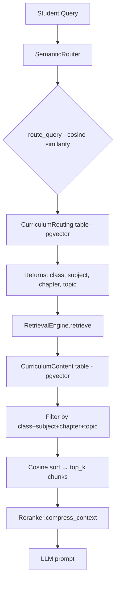

# VishwAlpha Backend — Database & Query Logic Analysis

## Current Architecture Overview



---

## Current Data Model — Relational Hierarchy

```
Board (boards)
  └── SchoolClass (classes)  [board_id FK]
        └── Subject (subjects)  [class_id FK]
              └── Chapter (chapters)  [subject_id FK]
                    └── Topic (topics)  [chapter_id FK]
                          └── ContentChunk (content_chunks)  [topic_id FK]
                          └── RawContentChunk (raw_content_chunks)  [topic_id FK]
```

**Vector tables (flat, denormalized — used for search)**:
| Table | Purpose | Key Columns |
|---|---|---|
| `curriculum_routing` | Semantic router — maps a query to a topic | `class_num, subject, chapter, topic, vector(384)` |
| `curriculum_content` | RAG retrieval — stores actual content chunks | `class_num, subject, chapter, topic, content, vector(384)` |

---

## Identified Problems in Current Query Logic

### 🔴 Problem 1: Routing is Totally Unscoped

**File**: [`routing/router.py`](file:///c:/Users/manit/OneDrive/Desktop/code/Vishwalpha/AI%20Tutor/routing/router.py#L36-L47)

```python
def route_query(self, query: str) -> dict | None:
    query_vector = self.embedder.embed_query(query)
    results = self.vector_store.search_routes(query_vector, limit=1)
    if results and results[0]["score"] > 0.4:
        return results[0]["payload"]
    return None
```

**Problem**: When a student of Class 7 asks "What is photosynthesis?", the router searches **ALL** routing vectors across ALL classes. It might return a Class 10 Biology result because that topic has a higher cosine score. The student's own class context is completely ignored.

---

### 🔴 Problem 2: `search_routes` Ignores Class/Subject Filter

**File**: [`routing/vector_store.py`](file:///c:/Users/manit/OneDrive/Desktop/code/Vishwalpha/AI%20Tutor/routing/vector_store.py#L51-L61)

```python
results = db.query(
    CurriculumRouting,
    (1 - distance).label("score")
).order_by(distance).limit(limit).all()
```

No `.filter()` at all — raw cosine search across the entire `curriculum_routing` table. For "7th class Chemistry topics", this is broken because the query scope (class=7, subject=Chemistry) is never passed down.

---

### 🔴 Problem 3: Cascade-Only Filter in RetrievalEngine — No Fallback

**File**: [`retrieval/engine.py`](file:///c:/Users/manit/OneDrive/Desktop/code/Vishwalpha/AI%20Tutor/retrieval/engine.py#L79-L95)

```python
if class_val is not None:
    query_obj = query_obj.filter(CurriculumContent.class_num == class_val)
if subject_val is not None:
    query_obj = query_obj.filter(CurriculumContent.subject == subject_val)
if chapter_val is not None:
    query_obj = query_obj.filter(CurriculumContent.chapter == chapter_val)
if topic_val is not None:
    query_obj = query_obj.filter(CurriculumContent.topic == topic_val)
```

**Problem**: All 4 filters are applied simultaneously with `AND`. If a topic-level match isn't found (due to mismatch in string), the query returns 0 rows — no graceful fallback to chapter or subject scope.

---

### 🔴 Problem 4: No DB Indexes on Filter Columns

**File**: [`db/models.py`](file:///c:/Users/manit/OneDrive/Desktop/code/Vishwalpha/AI%20Tutor/db/models.py)

```python
class_num = Column(Integer, nullable=True)   # no index
subject = Column(String(100), nullable=True) # no index
chapter = Column(String(200), nullable=True) # no index
topic = Column(String(200), nullable=True)   # no index
```

No `index=True` on any of the metadata columns in `CurriculumRouting` or `CurriculumContent`. Full table scans on every query.

---

### 🟡 Problem 5: Student's Class Not Injected Into Routing

The `ChatRequest` schema carries `student_id` and `subject`, but not the student's class. The tutor never passes the student's enrolled class to the router — so the router can't pre-filter.

**File**: [`schemas.py`](file:///c:/Users/manit/OneDrive/Desktop/code/Vishwalpha/AI%20Tutor/schemas.py#L81-L93)

```python
class ChatRequest(BaseModel):
    student_id: str
    session_id: str = ""
    question: str
    subject: str = Field(default="Science")
    tutor_mode: str = Field(default="standard")
    # ❌ Missing: class_num
```

---

### 🟡 Problem 6: String Matching on Chapter/Topic Is Fragile

The router returns a `chapter` string like `"Chemical Reactions and Equations"` and the retrieval engine does `WHERE chapter = 'Chemical Reactions and Equations'`. If there's any casing or spacing difference, the join breaks silently.

---

## Proposed New Query Logic — Systematic & Scoped

### Architecture

```
Student Query
  ├── class_num  ← from Student.class_num (always known)
  ├── subject    ← from ChatRequest.subject
  └── question   ← free text

Level 1 (Scoped Routing):
  CurriculumRouting
    WHERE class_num = ? AND subject = ?   ← hard filters
    ORDER BY cosine_distance(vector, query_vector)
    LIMIT 3
  → returns: [chapter, topic, score]

Level 2 (Cascading Retrieval with Fallback):
  Try: WHERE class=? AND subject=? AND chapter=? AND topic=?  → top 5
  If < 3 results:
    Fallback: WHERE class=? AND subject=? AND chapter=?       → top 5
  If < 3 results:
    Fallback: WHERE class=? AND subject=?                     → top 5
```

---

## Concrete Changes Required

### 1. Add DB Indexes to Vector Tables

**File**: [`db/models.py`](file:///c:/Users/manit/OneDrive/Desktop/code/Vishwalpha/AI%20Tutor/db/models.py)

```python
class CurriculumRouting(Base):
    __tablename__ = "curriculum_routing"
    id = Column(String(100), primary_key=True)
    class_num = Column(Integer, nullable=True, index=True)  # ✅ ADD INDEX
    subject = Column(String(100), nullable=True, index=True)  # ✅ ADD INDEX
    chapter = Column(String(200), nullable=True, index=True)  # ✅ ADD INDEX
    topic = Column(String(200), nullable=True)
    vector = Column(Vector(384), nullable=False)

class CurriculumContent(Base):
    __tablename__ = "curriculum_content"
    id = Column(String(100), primary_key=True)
    class_num = Column(Integer, nullable=True, index=True)  # ✅ ADD INDEX
    subject = Column(String(100), nullable=True, index=True)  # ✅ ADD INDEX
    chapter = Column(String(200), nullable=True, index=True)  # ✅ ADD INDEX
    topic = Column(String(200), nullable=True)
    content = Column(Text, nullable=False)
    vector = Column(Vector(384), nullable=False)
```

---

### 2. Make `search_routes` Accept Class + Subject Filters

**File**: [`routing/vector_store.py`](file:///c:/Users/manit/OneDrive/Desktop/code/Vishwalpha/AI%20Tutor/routing/vector_store.py)

```python
def search_routes(
    self,
    query_vector: list[float],
    limit: int = 3,
    class_num: int | None = None,     # ✅ NEW
    subject: str | None = None,       # ✅ NEW
) -> list[dict]:
    with managed_session() as db:
        distance = CurriculumRouting.vector.cosine_distance(query_vector)
        query_obj = db.query(
            CurriculumRouting,
            (1 - distance).label("score")
        )
        # ✅ Apply scoped filters BEFORE vector sort
        if class_num is not None:
            query_obj = query_obj.filter(CurriculumRouting.class_num == class_num)
        if subject is not None:
            query_obj = query_obj.filter(CurriculumRouting.subject == subject)

        results = query_obj.order_by(distance).limit(limit).all()
        ...
```

---

### 3. Pass `class_num` + `subject` Into Router

**File**: [`routing/router.py`](file:///c:/Users/manit/OneDrive/Desktop/code/Vishwalpha/AI%20Tutor/routing/router.py)

```python
def route_query(
    self,
    query: str,
    class_num: int | None = None,   # ✅ NEW
    subject: str | None = None,     # ✅ NEW
) -> dict | None:
    query_vector = self.embedder.embed_query(query)
    results = self.vector_store.search_routes(
        query_vector, limit=3,
        class_num=class_num,   # ✅ pass down
        subject=subject,       # ✅ pass down
    )
    if results and results[0]["score"] > 0.4:
        return results[0]["payload"]
    return None
```

---

### 4. Cascading Fallback Retrieval

**File**: [`retrieval/engine.py`](file:///c:/Users/manit/OneDrive/Desktop/code/Vishwalpha/AI%20Tutor/retrieval/engine.py)

```python
def retrieve(
    self, query: str, routing_metadata: dict,
    top_k: int = 5, min_results: int = 3
) -> list[dict]:
    """
    Retrieves with progressive fallback:
      Level 1: class + subject + chapter + topic
      Level 2: class + subject + chapter           (if level 1 < min_results)
      Level 3: class + subject                     (if level 2 < min_results)
    """
    query_vector = self.embedder.embed_query(query)
    
    filter_levels = [
        # Most specific → least specific
        {
            "class_num": routing_metadata.get("class"),
            "subject":   routing_metadata.get("subject"),
            "chapter":   routing_metadata.get("chapter"),
            "topic":     routing_metadata.get("topic"),
        },
        {
            "class_num": routing_metadata.get("class"),
            "subject":   routing_metadata.get("subject"),
            "chapter":   routing_metadata.get("chapter"),
        },
        {
            "class_num": routing_metadata.get("class"),
            "subject":   routing_metadata.get("subject"),
        },
    ]
    
    for filters in filter_levels:
        results = self._run_query(query_vector, filters, top_k)
        if len(results) >= min_results:
            return results
    
    return results  # best we found
```

---

### 5. Add `class_num` to `ChatRequest`

**File**: [`schemas.py`](file:///c:/Users/manit/OneDrive/Desktop/code/Vishwalpha/AI%20Tutor/schemas.py)

```python
class ChatRequest(BaseModel):
    student_id: str
    session_id: str = ""
    question: str
    subject: str = Field(default="Science")
    class_num: int | None = Field(default=None, description="Student's class level")  # ✅ NEW
    tutor_mode: str = Field(default="standard")
```

In the tutor chat handler, read the student's class from DB if not provided:
```python
# In tutor/chat.py — resolve class_num
class_num = request.class_num
if class_num is None:
    student = db.query(Student).filter(Student.id == request.student_id).first()
    class_num = student.class_num if student else None
```

---

## Query Scenarios After Changes

| User Intent | How It Works |
|---|---|
| **"Class 7 Chemistry topics"** | Router searches `curriculum_routing WHERE class_num=7 AND subject='Chemistry'` → returns all topic routes scoped to class 7 chem |
| **"Explain photosynthesis"** (Class 7 student) | Router pre-filtered to class=7, finds correct grade-appropriate topic |
| **"What is Newton's 3rd law?"** | Router finds Class 10 Physics, Chapter 3, Topic = Newton's Laws; fallback retrieval catches all chunks |
| **Off-topic / general question** | Router returns `None` (no topic >0.4 score in their class+subject) → tutor handles as general |
| **Subject browse** | Frontend calls new `/curriculum/topics?class_num=7&subject=Chemistry` → queries `curriculum_routing` directly |

---

## New API Endpoints to Add

```python
# GET /curriculum/subjects?class_num=7
# → Returns all subjects available for a class
# Query: SELECT DISTINCT subject FROM curriculum_routing WHERE class_num=?

# GET /curriculum/chapters?class_num=7&subject=Chemistry
# → Returns all chapters for class+subject
# Query: SELECT DISTINCT chapter FROM curriculum_routing WHERE class_num=? AND subject=?

# GET /curriculum/topics?class_num=7&subject=Chemistry&chapter=Acids+Bases+and+Salts
# → Returns all topics for class+subject+chapter
# Query: SELECT DISTINCT topic FROM curriculum_routing WHERE class_num=? AND subject=? AND chapter=?
```

These make the curriculum browsable from the frontend without vector search.

---

## Summary of All Files to Change

| File | Change |
|---|---|
| [`db/models.py`](file:///c:/Users/manit/OneDrive/Desktop/code/Vishwalpha/AI%20Tutor/db/models.py) | Add `index=True` to `class_num`, `subject`, `chapter` in both vector tables |
| [`schemas.py`](file:///c:/Users/manit/OneDrive/Desktop/code/Vishwalpha/AI%20Tutor/schemas.py) | Add `class_num` field to `ChatRequest` |
| [`routing/vector_store.py`](file:///c:/Users/manit/OneDrive/Desktop/code/Vishwalpha/AI%20Tutor/routing/vector_store.py) | `search_routes()` accepts `class_num`, `subject` and pre-filters |
| [`routing/router.py`](file:///c:/Users/manit/OneDrive/Desktop/code/Vishwalpha/AI%20Tutor/routing/router.py) | `route_query()` accepts and passes `class_num`, `subject` |
| [`retrieval/engine.py`](file:///c:/Users/manit/OneDrive/Desktop/code/Vishwalpha/AI%20Tutor/retrieval/engine.py) | Add cascading fallback retrieval |
| [`retrieval/query.py`](file:///c:/Users/manit/OneDrive/Desktop/code/Vishwalpha/AI%20Tutor/retrieval/query.py) | `query_system()` accepts `class_num`, `subject`, passes to router |
| [`api.py`](file:///c:/Users/manit/OneDrive/Desktop/code/Vishwalpha/AI%20Tutor/api.py) | Add 3 curriculum browse endpoints |
| [`tutor/chat.py`](file:///c:/Users/manit/OneDrive/Desktop/code/Vishwalpha/AI%20Tutor/tutor/chat.py) | Resolve and inject `class_num` into routing call |
