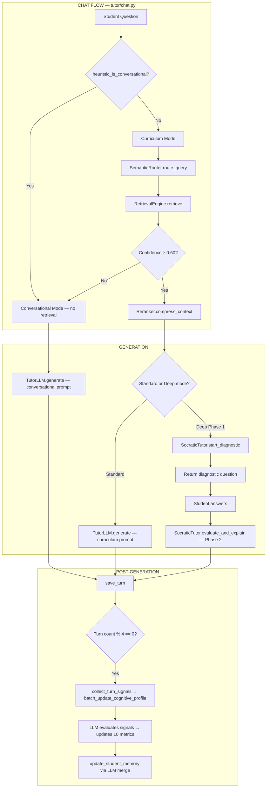
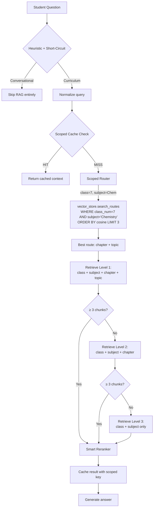
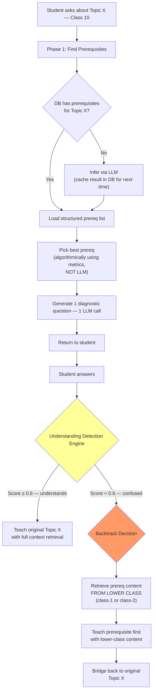
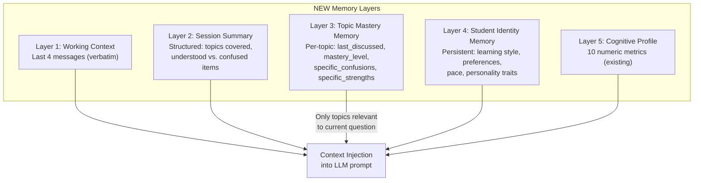
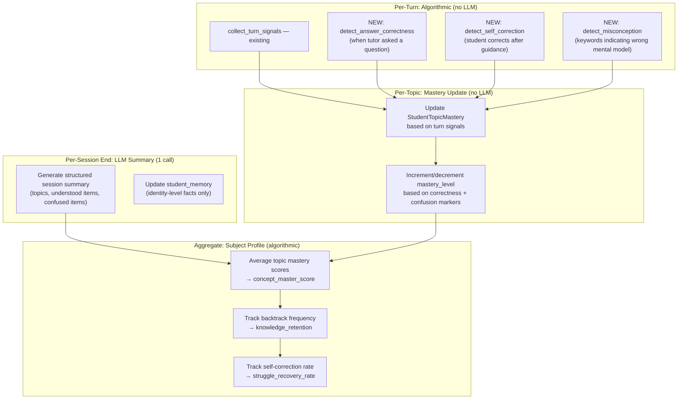
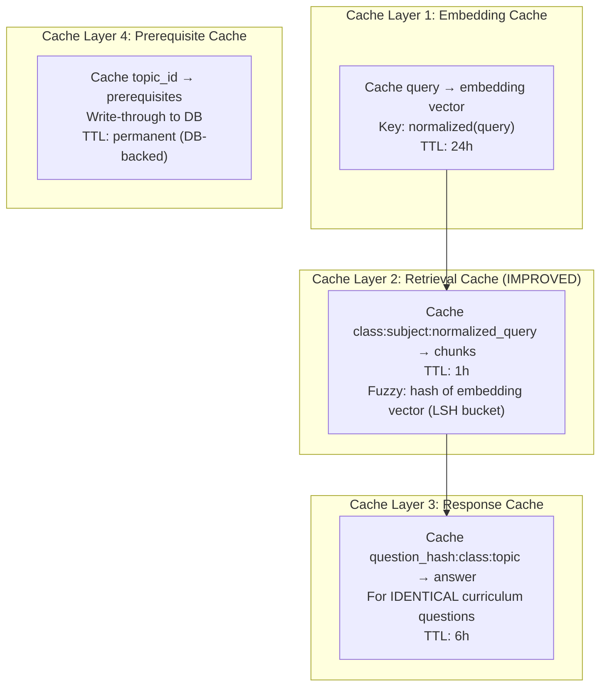

# VishwAlpha Backend — Complete System Analysis & Redesign

> **Scope**: Full RAG pipeline, chatbot algorithm, routing, Socratic mode, memory, cognitive profiles, caching, and token cost optimization.

---

## Table of Contents
1. [Current Architecture Map](#1-current-architecture-map)
2. [RAG Pipeline & Routing — Problems & Redesign](#2-rag-pipeline--routing)
3. [Chatbot Algorithm & Socratic Mode — Problems & Redesign](#3-chatbot-algorithm--socratic-mode)
4. [Memory & Personalisation — Problems & Redesign](#4-memory--personalisation)
5. [Cognitive Profile & Scoring — Problems & Redesign](#5-cognitive-profile--scoring)
6. [Token Cost Optimization & Caching — Problems & Redesign](#6-token-cost-optimization--caching)
7. [File-by-File Change Map](#7-file-by-file-change-map)

---

## 1. Current Architecture Map



### Current LLM Call Map (Per Single Chat Turn)

| Stage | LLM Call | Tokens (approx) | When |
|---|---|---|---|
| Question classification | ❌ None (heuristic) | 0 | Always |
| Routing | ❌ None (vector similarity) | 0 | Always |
| **Generation** | ✅ Groq `llama-3.1-8b` | **~1500-2000** | Always |
| **Socratic Phase 1** | ✅ 3× Groq calls (infer prereqs + pick prereq + generate diag question) | **~800** | Deep mode only |
| **Socratic Phase 2** | ✅ 1× Groq call (evaluate + explain) | **~1200** | Deep mode only |
| **Batch metrics update** | ✅ 1× Groq call | **~800** | Every 4 turns |
| **Memory compression** | ✅ 1× Groq call | **~500** | When messages > 6 |
| **Memory merge** | ✅ 1× Groq call | **~500** | Every 4 turns (with remark) |

**Worst case per deep-mode turn at batch boundary: 6 LLM calls, ~4800 tokens**

---

## 2. RAG Pipeline & Routing

### Current Flow (files involved)

```
Student question
  → tutor/patterns.py        — heuristic classification (regex)
  → routing/embedder.py      — BGE-small-en-v1.5 (384-dim)
  → routing/router.py        — cosine similarity on curriculum_routing table
  → routing/vector_store.py  — raw pgvector search (NO filters)
  → retrieval/engine.py      — filtered pgvector search on curriculum_content
  → retrieval/reranker.py    — sort by score, truncate to ~1500 tokens
  → retrieval/cache.py       — Redis cache (exact query match only)
```

### 🔴 Problem 2.1: Routing is Globally Unscoped

**File**: [router.py](file:///c:/Users/manit/OneDrive/Desktop/code/Vishwalpha/AI%20Tutor/routing/router.py#L36-L47)

`route_query()` accepts NO class/subject filters. A Class 7 student asking "What is an acid?" can be routed to Class 12 Chemistry content because the Class 12 topic has higher cosine similarity.

**File**: [vector_store.py](file:///c:/Users/manit/OneDrive/Desktop/code/Vishwalpha/AI%20Tutor/routing/vector_store.py#L51-L61)

`search_routes()` does a raw `ORDER BY cosine_distance LIMIT N` with zero WHERE clauses.

### 🔴 Problem 2.2: chat.py Overrides Route AFTER Routing

**File**: [chat.py L79-82](file:///c:/Users/manit/OneDrive/Desktop/code/Vishwalpha/AI%20Tutor/tutor/chat.py#L79-L82)

```python
if class_num:
    route["class"] = class_num    # ← overwrites AFTER the route already resolved
if subject:
    route["subject"] = subject
```

This patches the route after it was already found for the wrong class. The router may return `chapter="Organic Chemistry"` from Class 12, but then the code forces `class=7` — resulting in zero retrieval matches because Class 7 has no "Organic Chemistry" chapter.

### 🔴 Problem 2.3: No Cascading Fallback in Retrieval

**File**: [engine.py L60-95](file:///c:/Users/manit/OneDrive/Desktop/code/Vishwalpha/AI%20Tutor/retrieval/engine.py#L60-L95)

All 4 filters (class, subject, chapter, topic) are AND'd. If any string doesn't match exactly → 0 results. No fallback to broader scope.

### 🟡 Problem 2.4: Cache Key is Raw Query String

**File**: [cache.py L49](file:///c:/Users/manit/OneDrive/Desktop/code/Vishwalpha/AI%20Tutor/retrieval/cache.py#L49)

```python
cached = self.redis_client.get(f"query_cache:{query}")
```

"What is pH?" and "what is pH" are different cache keys. The cache also ignores the student's class — a Class 7 and Class 10 student asking the same question get the same cached result.

### 🟡 Problem 2.5: Reranker is Just a Score Sorter

**File**: [reranker.py](file:///c:/Users/manit/OneDrive/Desktop/code/Vishwalpha/AI%20Tutor/retrieval/reranker.py)

The "reranker" just sorts by cosine score and concatenates. No actual cross-encoder reranking, no diversity dedup, no chunk merging for adjacent content.

---

### Proposed Redesign: RAG Pipeline



**Key changes**:
1. Router receives `class_num` + `subject` and pre-filters BEFORE cosine sort
2. 3-level cascading fallback retrieval
3. Cache key includes `class_num:subject:normalized_query`
4. Smart reranker with diversity (avoid 5 chunks from same topic)

---

## 3. Chatbot Algorithm & Socratic Mode

### Current Socratic Flow (Deep Mode)

```
Phase 1 (3 LLM calls):
  1. _fetch_prerequisites_from_db()  → often returns []
  2. _infer_prerequisites_via_llm()  → LLM call #1 (200 tokens)
  3. _pick_best_prerequisite()       → LLM call #2 (150 tokens)
  4. generate diagnostic question    → LLM call #3 (200 tokens)
  → Return diagnostic question to student

Phase 2 (1 LLM call):
  5. evaluate_and_explain()          → LLM call #4 (900 tokens)
  → Return adaptive explanation
```

### 🔴 Problem 3.1: NO Cross-Class Prerequisite Backtracking

**The core feature you want** — when a Class 10 student can't answer a prerequisite about "Chemical Bonding", the system should backtrack to Class 8 or 9 to find foundational content and teach from there.

**Currently**: The system infers prerequisites via LLM prompt, picks one, asks ONE diagnostic question, and then jumps straight to explaining the original topic regardless of whether the student showed ANY understanding. There is:
- No retrieval of lower-class content
- No multi-step backtracking
- No understanding detection from the student's diagnostic answer

**File**: [socratic.py L304-336](file:///c:/Users/manit/OneDrive/Desktop/code/Vishwalpha/AI%20Tutor/tutor/socratic.py#L304-L336)

`evaluate_and_explain()` takes the student response and generates an explanation, but it NEVER:
- Determines if the student truly doesn't understand the prerequisite
- Retrieves content from a lower class
- Decides whether to go deeper before teaching the original topic

### 🔴 Problem 3.2: 3 LLM Calls in Phase 1 — Expensive and Fragile

Every deep-mode question triggers 3 sequential LLM calls just for the diagnostic question. If any fails, the whole thing breaks. The prerequisite inference via LLM is non-deterministic — it may infer different prerequisites each time for the same topic.

### 🔴 Problem 3.3: Understanding Detection is Absent

After the student answers the diagnostic, the system has NO algorithmic way to detect if the answer shows understanding or not. It just feeds the raw student response to the LLM and hopes the LLM adapts. There's no:
- Keyword matching against expected concepts
- Confidence scoring of the student's response
- Decision tree: "understand" → teach original topic vs "confused" → backtrack further

### 🟡 Problem 3.4: Prerequisites Stored as JSON in Topics Table

**File**: [models.py L66](file:///c:/Users/manit/OneDrive/Desktop/code/Vishwalpha/AI%20Tutor/db/models.py#L66)

```python
prerequisites = Column(Text, nullable=True)  # JSON array of strings
```

Prerequisites are unstructured strings like `["Chemical Bonding basics"]`. They have no foreign key to an actual topic in a lower class, so the system can't resolve them to actual content.

---

### Proposed Redesign: Intelligent Backtracking Engine



**Key design: Understanding Detection Engine** (algorithmic, no LLM):

```python
def detect_understanding(student_response: str, prerequisite: str, expected_keywords: list[str]) -> float:
    """
    Returns 0.0 - 1.0 understanding score.
    
    Signals:
    - Keyword overlap with expected concepts (weighted 40%)
    - Response length and specificity (weighted 20%)
    - Absence of confusion markers: "I don't know", "not sure", "what is" (weighted 20%)
    - Structural coherence: contains cause-effect or definition patterns (weighted 20%)
    """
```

**Key design: Prerequisite DB Model** (structured, not just strings):

```python
class TopicPrerequisite(Base):
    __tablename__ = "topic_prerequisites"
    id = Column(Integer, primary_key=True)
    topic_id = Column(Integer, ForeignKey("topics.id"))           # Current topic
    prereq_topic_id = Column(Integer, ForeignKey("topics.id"), nullable=True)  # Link to actual topic
    prereq_class_num = Column(Integer)                            # Which class
    prereq_subject = Column(String(100))
    prereq_description = Column(Text)                             # Human-readable
    difficulty_order = Column(Integer, default=0)                  # 0 = most foundational
    expected_keywords = Column(Text)                               # JSON: keywords student should know
```

**Backtracking Algorithm**:

```python
def backtrack_for_prerequisite(prereq: TopicPrerequisite, student_class: int):
    """
    Minimal backtracking: search from student's class DOWNWARD.
    Stop at the first class that has relevant content.
    
    Search order: class-1, class-2, class-3 (max 3 levels back)
    """
    for offset in range(1, 4):  # max 3 classes back
        target_class = student_class - offset
        if target_class < 1:
            break
        
        # Try to find content in the lower class
        chunks = retrieve(query=prereq.prereq_description,
                         routing_metadata={
                             "class": target_class,
                             "subject": prereq.prereq_subject
                         })
        if chunks:
            return chunks, target_class
    
    return None, None  # No backtrack content found
```

**Token savings**: Replaces 3 LLM calls with 1 LLM call + algorithmic picking + DB lookup.

---

## 4. Memory & Personalisation

### Current Memory Architecture

```
┌─────────────────────────────────────────────────────────────┐
│ Layer 1: Recent Messages (verbatim)                         │
│   → Last 4 messages from conversation_messages table        │
│   → Sent raw to LLM as conversation history                 │
├─────────────────────────────────────────────────────────────┤
│ Layer 2: Session Summary (compressed)                       │
│   → conversation_sessions.summary                           │
│   → LLM-generated summary of older messages (>4)            │
│   → Injected as "EARLIER CONVERSATION SUMMARY" system msg   │
├─────────────────────────────────────────────────────────────┤
│ Layer 3: Student Memory (persistent)                        │
│   → student_subject_profiles.student_memory (JSON array)    │
│   → LLM-merged facts like "Struggles with pH problems"      │
│   → Max 8 bullet points                                     │
│   → Injected as "STUDENT MEMORY" system msg                 │
├─────────────────────────────────────────────────────────────┤
│ Layer 4: Cognitive Profile (metrics)                        │
│   → 10 numeric metrics on StudentSubjectProfile             │
│   → Formatted into personalization instructions             │
└─────────────────────────────────────────────────────────────┘
```

### 🔴 Problem 4.1: Memory is Flat — No Topic-Level Granularity

**File**: [models.py L133](file:///c:/Users/manit/OneDrive/Desktop/code/Vishwalpha/AI%20Tutor/db/models.py#L133)

```python
student_memory = Column(Text, nullable=True)  # JSON: 8 bullet points
```

Memory is stored per-subject, not per-topic. The LLM sees 8 generic bullets like "Struggles with pH problems" regardless of whether the current topic is about pH or Newton's Laws. This wastes tokens on irrelevant memory AND misses topic-specific recall.

### 🔴 Problem 4.2: Memory Merge is Non-Deterministic and Lossy

**File**: [memory.py L299-351](file:///c:/Users/manit/OneDrive/Desktop/code/Vishwalpha/AI%20Tutor/db/memory.py#L299-L351)

Every 4 turns, an LLM call merges new observations into the memory, but:
- The LLM may arbitrarily drop important facts to stay under 8 bullets
- No versioning — old memory is overwritten permanently
- No decay mechanism — a fact from 2 months ago has equal weight to one from today
- The merge prompt is context-limited (600 chars of recent turns)

### 🔴 Problem 4.3: Session Summary Compression Loses Structure

**File**: [memory.py L211-278](file:///c:/Users/manit/OneDrive/Desktop/code/Vishwalpha/AI%20Tutor/db/memory.py#L211-L278)

The compression just dumps old messages into a single paragraph summary. It loses:
- Which specific topics were discussed
- What the student got right vs. wrong
- The sequence of understanding development

### 🟡 Problem 4.4: No Cross-Session Topic Continuity

When a student returns to the same topic in a new session, there's NO mechanism to recall what they discussed before on that specific topic. The system treats every session as mostly independent.

---

### Proposed Redesign: Structured Memory Architecture



**New DB Model: Topic Mastery**

```python
class StudentTopicMastery(Base):
    """Tracks per-student, per-topic understanding over time."""
    __tablename__ = "student_topic_mastery"
    id = Column(Integer, primary_key=True)
    student_id = Column(String(100), ForeignKey("students.id"))
    topic_id = Column(Integer, ForeignKey("topics.id"))
    
    mastery_level = Column(Float, default=0.0)        # 0-100
    times_visited = Column(Integer, default=0)
    last_visited = Column(DateTime(timezone=True))
    
    # Structured memory (not free-text)
    understood_concepts = Column(Text)     # JSON: ["concept1", "concept2"]
    confused_concepts = Column(Text)       # JSON: ["concept3"]
    common_mistakes = Column(Text)         # JSON: ["mistake1"]
    
    # Backtrack history
    required_backtrack = Column(Boolean, default=False)
    backtrack_class = Column(Integer, nullable=True)   # Which class was backtracked to
```

**Memory injection becomes smart — only inject relevant topic memories**:

```python
def get_relevant_memories(student_id, current_topic_id, related_topic_ids):
    """
    Instead of dumping all 8 bullets, fetch ONLY memories
    relevant to the current topic and its prerequisites.
    """
    masteries = db.query(StudentTopicMastery).filter(
        StudentTopicMastery.student_id == student_id,
        StudentTopicMastery.topic_id.in_([current_topic_id] + related_topic_ids)
    ).all()
    # Format only the relevant confused/understood items
```

---

## 5. Cognitive Profile & Scoring

### Current System

**Signal collection** ([metrics.py L92-139](file:///c:/Users/manit/OneDrive/Desktop/code/Vishwalpha/AI%20Tutor/db/metrics.py#L92-L139)):
- Purely algorithmic per-turn: word count, regex for follow-ups, regex for analytical patterns, keyword overlap with recent history
- Stored as pending signals on the subject profile

**Batch update** ([metrics.py L152-240](file:///c:/Users/manit/OneDrive/Desktop/code/Vishwalpha/AI%20Tutor/db/metrics.py#L152-L240)):
- Every 4 turns, feeds ALL pending signals to an LLM
- LLM returns absolute new values for all 10 metrics
- Delta is computed and applied with clamping

**5 cognitive skills** derived from 10 metrics ([metrics.py L335-357](file:///c:/Users/manit/OneDrive/Desktop/code/Vishwalpha/AI%20Tutor/db/metrics.py#L335-L357)):
```
concept_understanding = (concept_master_score + assessment_accuracy) / 2
learning_effort       = (practice_intensity + persistence + engagement) / 3
learning_adaptability = (recovery + (1 - error_repetition_rate) * 100) / 2
knowledge_stability   = (retention + velocity) / 2
cognitive_depth       = cognitive_thinking_level
```

### 🔴 Problem 5.1: LLM-Driven Metrics Are Non-Deterministic

The same conversation can produce different metrics depending on LLM temperature, prompt ordering, and model mood. A 10-metric holistic update via LLM is inherently unreliable — the LLM might arbitrarily spike `learning_velocity` from 50 to 80 because the student asked 2 questions.

### 🔴 Problem 5.2: No Topic-Level Scoring

All metrics are per-subject. The system can't tell you "Student X understands Acids & Bases (85%) but struggles with Chemical Equations (30%)". Everything is averaged into one blob per subject.

### 🔴 Problem 5.3: Assessment Accuracy is Never Actually Measured

`assessment_accuracy` exists as a metric but is never directly measured. The system has no quiz/assessment mechanism to actually test a student and measure their accuracy. The LLM just guesses a number.

### 🔴 Problem 5.4: Signals Don't Capture Understanding Quality

**File**: [metrics.py L92-139](file:///c:/Users/manit/OneDrive/Desktop/code/Vishwalpha/AI%20Tutor/db/metrics.py#L92-L139)

Current signals are purely syntactic:
- `word_count` — does length mean understanding?
- `is_followup` — regex matching for "why", "how"
- `references_prior` — keyword overlap (words > 5 chars)
- `gave_up` — regex for "skip", "don't care"

**Missing signals**:
- Did the student correctly answer a tutor's question?
- Did the student self-correct after being guided?
- Did the student demonstrate misconceptions?
- How many times has the student returned to this topic?

### 🟡 Problem 5.5: Batch Update Every 4 Turns is Arbitrary

Why 4? A high-engagement student doing 20 turns in a session gets 5 batch updates. A casual student doing 2 turns gets 0. The metrics for a casual student NEVER update in short sessions.

---

### Proposed Redesign: Hybrid Scoring System



**Key principle**: Subject-level metrics should be COMPUTED from topic-level mastery, not estimated by an LLM.

```python
def recompute_subject_metrics_from_mastery(student_id: str, subject: str):
    """
    Computes subject-level metrics by aggregating topic mastery data.
    No LLM needed — pure math.
    """
    masteries = db.query(StudentTopicMastery).join(Topic).join(Chapter).join(DBSubject).filter(
        StudentTopicMastery.student_id == student_id,
        DBSubject.name == subject
    ).all()
    
    if not masteries:
        return
    
    profile = get_or_create_subject_profile(db, student_id, subject)
    
    # concept_master_score = weighted average of topic mastery levels
    profile.concept_master_score = sum(m.mastery_level for m in masteries) / len(masteries)
    
    # knowledge_retention = ratio of topics with mastery > 50 on revisit
    revisited = [m for m in masteries if m.times_visited > 1]
    profile.knowledge_retention = (
        sum(1 for m in revisited if m.mastery_level > 50) / max(1, len(revisited)) * 100
    )
    
    # learning_velocity = average mastery gained per visit
    # ... etc for each metric
```

---

## 6. Token Cost Optimization & Caching

### Current Token Usage Problems

| Problem | Where | Token Waste |
|---|---|---|
| **Full personalization prompt sent on EVERY turn** | [llm.py L185-207](file:///c:/Users/manit/OneDrive/Desktop/code/Vishwalpha/AI%20Tutor/tutor/llm.py#L185-L207) | ~300 tokens/turn for the same student profile |
| **All 8 memory bullets injected regardless of relevance** | [llm.py L199-207](file:///c:/Users/manit/OneDrive/Desktop/code/Vishwalpha/AI%20Tutor/tutor/llm.py#L199-L207) | ~200 tokens/turn |
| **Session summary grows unboundedly** | [memory.py L239-243](file:///c:/Users/manit/OneDrive/Desktop/code/Vishwalpha/AI%20Tutor/db/memory.py#L239-L243) | ~300 tokens/turn |
| **3 LLM calls for Socratic Phase 1** | [socratic.py L246-302](file:///c:/Users/manit/OneDrive/Desktop/code/Vishwalpha/AI%20Tutor/tutor/socratic.py#L246-L302) | ~550 tokens per deep question |
| **Batch update sends full signal dump to LLM** | [metrics.py L195-199](file:///c:/Users/manit/OneDrive/Desktop/code/Vishwalpha/AI%20Tutor/db/metrics.py#L195-L199) | ~800 tokens every 4 turns |
| **Prompt log saves ENTIRE prompt to DB every turn** | [llm.py L137-138](file:///c:/Users/manit/OneDrive/Desktop/code/Vishwalpha/AI%20Tutor/tutor/llm.py#L137-L138) | DB bloat (not token cost, but storage) |
| **Cache is exact-match only, unscoped** | [cache.py L49](file:///c:/Users/manit/OneDrive/Desktop/code/Vishwalpha/AI%20Tutor/retrieval/cache.py#L49) | Repeated embedding + retrieval for similar queries |

### Proposed: Tiered Caching + Token Budget System



**Token Budget System**:

```python
class TokenBudget:
    """Controls prompt size to minimize cost."""
    
    MAX_SYSTEM_TOKENS = 600      # System prompt (fixed)
    MAX_PERSONALIZATION = 150    # Only if metrics changed since last turn
    MAX_CONTEXT = 1200           # RAG context
    MAX_MEMORY = 100             # Only relevant topic memories
    MAX_HISTORY = 400            # Recent turns
    MAX_SUMMARY = 200            # Session summary
    
    TOTAL_BUDGET = 2650          # Total input budget
    
    def should_include_personalization(self, metrics_changed: bool) -> bool:
        """Only include personalization block if metrics changed since last injection."""
        return metrics_changed
    
    def select_relevant_memories(self, all_memories: list, current_topic: str) -> list:
        """Filter to only topic-relevant memories, max 3 items."""
        return [m for m in all_memories if topic_relevant(m, current_topic)][:3]
    
    def truncate_summary(self, summary: str) -> str:
        """Keep only last 200 tokens of summary."""
        return summary[-800:]  # ~200 tokens
```

**Socratic Phase 1 → Reduce from 3 LLM calls to 1**:

```python
def start_diagnostic_v2(self, question, topic, class_num, subject, context, metrics):
    # 1. Prerequisites: DB lookup first (FREE), LLM only if DB empty (cached for next time)
    prerequisites = _fetch_prerequisites_from_db(topic, chapter)
    
    # 2. Pick best prerequisite: ALGORITHMIC (FREE)
    #    Rule: if concept_understanding < 40%, pick most foundational
    #    Rule: if concept_understanding > 70%, pick most advanced
    chosen = _algorithmic_pick(prerequisites, metrics)
    
    # 3. Generate diagnostic question: 1 LLM call (ONLY LLM call in Phase 1)
    diag_question = self._generate_diagnostic(question, chosen)
    
    return diag_question, state
```

**Savings per deep-mode turn**: 3 LLM calls → 1 LLM call = ~400 tokens saved.

---

## 7. File-by-File Change Map

| File | Module | Changes |
|---|---|---|
| [`db/models.py`](file:///c:/Users/manit/OneDrive/Desktop/code/Vishwalpha/AI%20Tutor/db/models.py) | Database | Add `StudentTopicMastery` model, add `TopicPrerequisite` model, add indexes on vector tables |
| [`schemas.py`](file:///c:/Users/manit/OneDrive/Desktop/code/Vishwalpha/AI%20Tutor/schemas.py) | Schemas | Add `class_num` to `ChatRequest`, add understanding score to `ChatResponse` |
| [`routing/vector_store.py`](file:///c:/Users/manit/OneDrive/Desktop/code/Vishwalpha/AI%20Tutor/routing/vector_store.py) | Routing | `search_routes()` accepts class/subject filters |
| [`routing/router.py`](file:///c:/Users/manit/OneDrive/Desktop/code/Vishwalpha/AI%20Tutor/routing/router.py) | Routing | `route_query()` accepts and passes class/subject |
| [`retrieval/engine.py`](file:///c:/Users/manit/OneDrive/Desktop/code/Vishwalpha/AI%20Tutor/retrieval/engine.py) | Retrieval | Cascading fallback retrieval, cross-class retrieval for backtracking |
| [`retrieval/cache.py`](file:///c:/Users/manit/OneDrive/Desktop/code/Vishwalpha/AI%20Tutor/retrieval/cache.py) | Caching | Scoped cache keys, embedding cache, prerequisite cache |
| [`retrieval/reranker.py`](file:///c:/Users/manit/OneDrive/Desktop/code/Vishwalpha/AI%20Tutor/retrieval/reranker.py) | Reranking | Diversity dedup, adjacent chunk merging |
| [`tutor/chat.py`](file:///c:/Users/manit/OneDrive/Desktop/code/Vishwalpha/AI%20Tutor/tutor/chat.py) | Chat Core | Inject class_num into routing, update topic mastery after each turn |
| [`tutor/llm.py`](file:///c:/Users/manit/OneDrive/Desktop/code/Vishwalpha/AI%20Tutor/tutor/llm.py) | LLM Layer | Token budget system, conditional personalization injection, relevant-only memory |
| [`tutor/socratic.py`](file:///c:/Users/manit/OneDrive/Desktop/code/Vishwalpha/AI%20Tutor/tutor/socratic.py) | Socratic | Understanding detection engine, cross-class backtracking, reduce to 1 LLM call in Phase 1 |
| [`tutor/patterns.py`](file:///c:/Users/manit/OneDrive/Desktop/code/Vishwalpha/AI%20Tutor/tutor/patterns.py) | Classification | Add understanding/confusion detection patterns |
| [`db/metrics.py`](file:///c:/Users/manit/OneDrive/Desktop/code/Vishwalpha/AI%20Tutor/db/metrics.py) | Metrics | New signals (correctness, self-correction, misconception), compute metrics from topic mastery |
| [`db/profile.py`](file:///c:/Users/manit/OneDrive/Desktop/code/Vishwalpha/AI%20Tutor/db/profile.py) | Profile | `recompute_subject_metrics_from_mastery()` function |
| [`db/memory.py`](file:///c:/Users/manit/OneDrive/Desktop/code/Vishwalpha/AI%20Tutor/db/memory.py) | Memory | Structured session summary, topic-relevant memory injection |
| [`api.py`](file:///c:/Users/manit/OneDrive/Desktop/code/Vishwalpha/AI%20Tutor/api.py) | API | Curriculum browse endpoints, topic mastery endpoint |

---

## Priority Order for Implementation

> [!IMPORTANT]
> **Phase 1 (Critical — fixes broken queries)**: Scoped routing, cascading retrieval, DB indexes
> 
> **Phase 2 (Core intelligence)**: Understanding detection, backtracking engine, topic mastery model
> 
> **Phase 3 (Memory & personalization)**: Structured memory, relevant-only injection, token budgeting
> 
> **Phase 4 (Cost optimization)**: Tiered caching, reduce Socratic LLM calls, conditional personalization

### Open Questions

> [!WARNING]
> 1. **Backtrack depth limit**: How many classes back should the system go? I suggest max 3 (e.g., Class 10 student → can backtrack to Class 7 at most).
> 
> 2. **Understanding threshold**: What score should trigger backtracking? I suggest 0.5 (below 50% understanding → backtrack).
> 
> 3. **Topic mastery storage**: Should mastery persist indefinitely, or decay over time (e.g., 5% per week of inactivity)?
> 
> 4. **Assessment integration**: Do you want an actual quiz/assessment mode, or should mastery be inferred purely from conversations?
> 
> 5. **Redis dependency**: The current Redis is a cloud instance. For the expanded caching (embedding cache, response cache), should we keep Redis or consider an in-memory LRU cache as primary with Redis as secondary?
